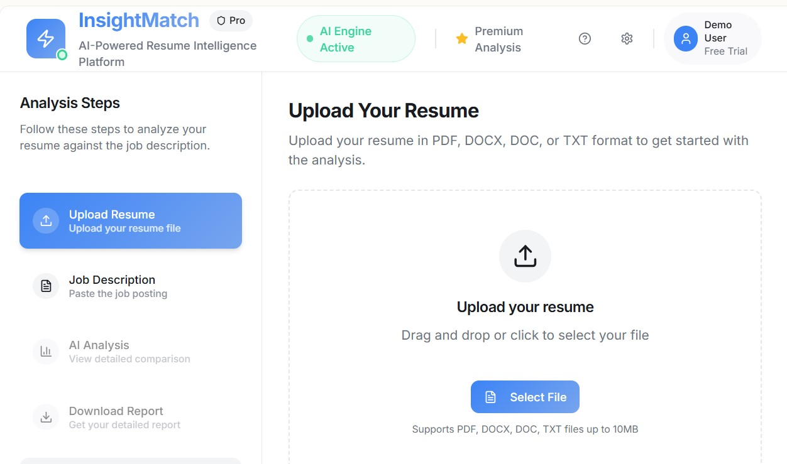

# 🚀 InsightMatch

**AI-Powered Resume & Job Description Analyzer**  
_Optimize your resume for every job — instantly._
<p align="center">
  
</p>
---

InsightMatch leverages advanced AI to analyze your resume against any job description, giving you actionable insights, match scoring, and detailed feedback — so you can stand out in your job search.

---

## ✨ Features

- **Smart Resume Upload:** Supports PDF, DOCX, and TXT formats.
- **Job Description Matching:** Paste any job description for instant analysis.
- **AI-Powered Insights:** Get a match score and section-by-section feedback.
- **Personalized Suggestions:** Receive concrete tips to boost your chances.
- **Downloadable Reports:** Export detailed improvement reports as needed.
- **Secure & Private:** Your data is handled with enterprise-grade security.

---

## 🖥️ Live Demo

Try InsightMatch instantly:  
👉 [InsightMatch on Lovable](https://lovable.dev/projects/0cc6d20c-28a3-493e-996c-f8f6bd8e4889)

---

## 🛠️ Tech Stack

- **Frontend:** [React](https://react.dev/) + [Vite](https://vitejs.dev/)
- **Type System:** [TypeScript](https://www.typescriptlang.org/)
- **UI:** [shadcn/ui](https://ui.shadcn.com/), [Tailwind CSS](https://tailwindcss.com/)

---

## 🚦 Quick Start

1. **Clone the Repository**
   ```bash
   git clone https://github.com/imsiddharthnegi/insight-match.git
   cd insight-match
   ```

2. **Install Dependencies**
   ```bash
   npm install
   ```

3. **Run the Development Server**
   ```bash
   npm run dev
   ```
   Open [http://localhost:5173](http://localhost:5173) in your browser.

---

## 📝 Usage

1. **Upload your resume**
2. **Paste the job description**
3. **Get instant AI analysis, feedback, and download your personalized report**

---

## 💼 Contributing

We welcome contributions!  
1. Fork this repo
2. Create a new branch (`git checkout -b feature/my-feature`)
3. Commit your changes (`git commit -am 'Add new feature'`)
4. Push to the branch (`git push origin feature/my-feature`)
5. Open a Pull Request

---

## 🛡️ License

Distributed under the MIT License. See `LICENSE` for details.

---


<p align="center">
  <sub>© 2025 InsightMatch. Built with ❤️ by Siddharth Negi.</sub>
</p>
